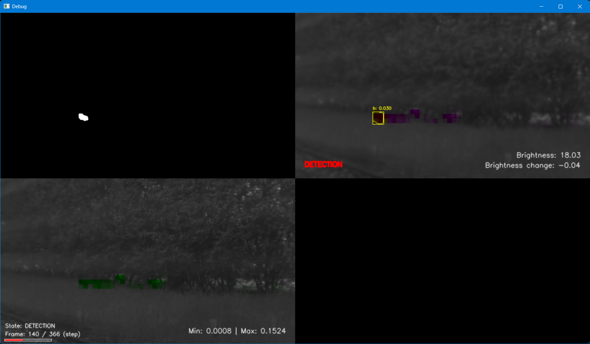
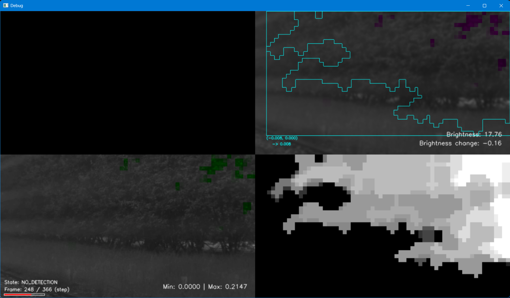
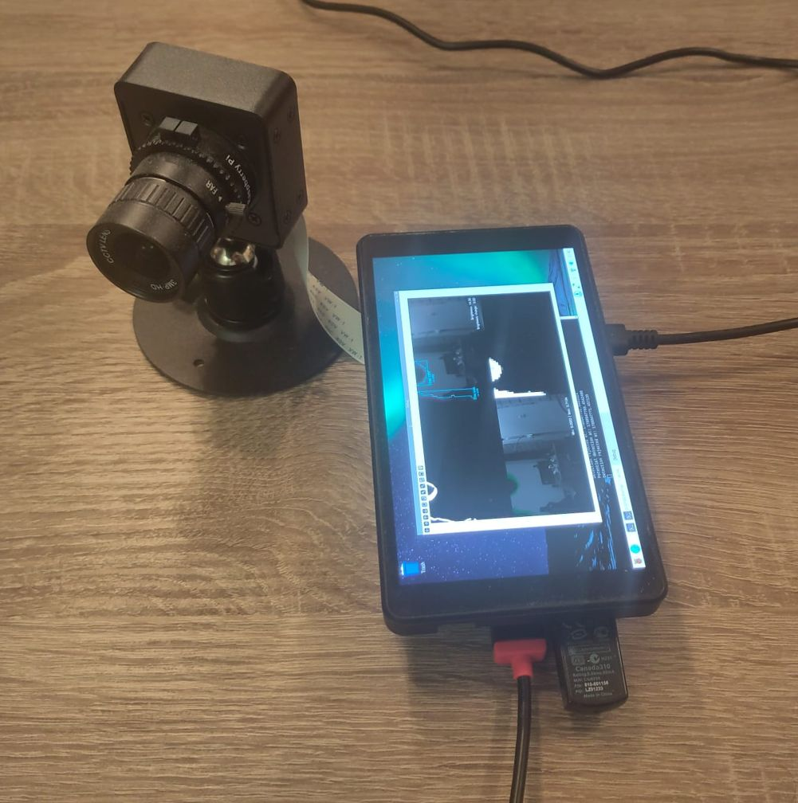

# Bird Guard

The goal of this app is to detect birds pecking grass seeds in the garden and sending alert notifications to the smartphone.
The app is built for a *Raspberry Pi 4* system with a *Pi High Quality Camera*, but is not limited to that and might be extended for other camera types in the future.

💡 For development and testing, a Raspberry Pi and/or a camera is not required, since a dummy camera module can be used to simulate the real camera behavior on a PC by using suitable videos and/or images as camera frame sources.

⚠️‼️ This is a personal project for lawn protection and learning image processing and camera based object tracking concepts (later also using AI approaches). ‼️⚠️

## Contents

- [Current Status](#current-status)
- [Setup](#setup)
- [Installation](#installation)
  - [For Users](#for-users)
    - [Starting the App](#starting-the-app) 
    - [User Folders](#user-folders)
  - [For Developers](#for-developers)
    - [Installation using PyCharm](#installation-using-pycharm)
      - [Starting the App (main.py)](#starting-the-app-mainpy)
    - [Manual installation](#manual-installation)
      - [Starting the App (manual)](#starting-the-app-manual)
    - [Dev Folders](#dev-folders)
- [Config File](#config-file)

---

# Current Status

### Vision Pipeline

* A method to detect changes in the image is implemented, but leads to a lot of false-positives caused by wind and lighting changes (clouds obstructing sunlight)
* To account for weak wind an "activity map" has been implemented to detect areas where common changes happen, which can then be counted with less influence  

* To account for lighting changes, a "brightness map" has been implemented to detect greater areas of brightness changes, for which detections are entirely ignored until the region is stable again  


### Features

* A video recorder has been implemented, which automatically records videos, triggered by detections
* The recorder uses a history buffer (for a configurable number of seconds) to include a few preceding seconds of video material before the recording was actually triggered
* A NTFY notify implementation is ready to use to get notifications on the smartphone on detections, but it's not yet integrated

### Current Problems/Challenges

* False-positives are still problematic and the solutions are contradictory: we want to detect brightness changes to prevent them causing a false-positive detection, but at the same time we like to detect moving objects, which also lead to a local brightness change in the image.  
Hence, we need to somehow distinguish between brightness changes due to sunlight obstruction and those caused by real objects, which is not trivial.
* Also, the activity map works for moving tree branches, but animals, which move slowly or remain at the same spot for some time, may also be counted to the background and would be ignored.  
In addition, if there is no continuous wind, even tree branches might be mostly static and only move occasionally, so they may still cause false-positives.
* Currently, any detected image change counts as detection, which may lead to false-positive detections, because of consecutive movements in different areas of the image.  
Thus, a mechanism is needed to match (and kind of track) bounding boxes of detections to bounding boxes of previous detections, so this effect can be filtered out.
* In general the detection approach is currently not robust and only works good under certain circumstances, due to the contradictory requirements and the many parameters, which influence the detection behavior.

### Next Steps

* Improve robustness by tracking detections over multiple frames
* Improve activity map and brightness map methodology and parameters
* Later: Integrate object detection models and evaluate performance on the Raspberry Pi hardware

---

# Setup

For this project I'm using:

* Raspberry Pi 4 B (8 GB)
* Waveshare 17527 5.5inch HDMI AMOLED (Touch-Display with case A)
* Raspberry Pi High Quality Camera
* 6mm CS-mount lens
* KKSB SBC Camera Case with 360 Degree Rotation Holder



💡 Note that the bird-guard software can also be used (and developed) on a Windows or Linux PC without any of the above hardware by using videos as dummy camera input.

---

# Installation

## For Users

1. Clone repository: 
```
git clone https://github.com/Single-MAlt-td/pi4-garden-bird-alert.git
cd pi4-garden-bird-alert
```

2. Switch to the desired branch, if needed (e.g. develop):
```
git checkout develop
```

3. Create a virtual environment and activate it (highly recommended):
```
python -m venv .venv
(Windows) -> .venv\Scripts\activate
(Linux/Raspi) -> source .venv/bin/activate
```

4. Install dependencies and app modules (ensure your venv is activated):
```
python -m pip install .
```

### Starting the App

Ensure your venv is activated! Then just execute:

```
bird-guard
```

On a similar Raspberry Pi system, the camera detection starts immediately and will run until the user quits (press Q ore Escape).

On a PC, the detection system also starts immediately, but uses the dummy camera, which replays the included video example (data folder is configurable in the `config.toml -> dummy_data_subfolder`). Press SPACE to pause the replay and step through the frames manually. Press TAB to continue the auto-replay.


### User Folders

Note the following user file locations:

* Config folder (contains the app configuration file (`config.toml`)):
  * Linux/Raspi: `/home/<user>/.config/bird_guard/config`
  * Windows: `C:\Users\<user>\AppData\Local\bird_guard\config`

* Data folder (may contain additional data, e.g. video recordings and dummy images): 
  * Linux/Raspi: `/home/<user>/.local/share/bird_guard/data`
  * Windows: `C:\Users\<user>\AppData\Local\bird_guard\data`


## For Developers

### Installation using PyCharm

Create a new project from the git repository:

* Open PyCharm
* Select: **File** → **Project from Version Control...** 
* Select **Repository URL** in the left sidebar (should be default)
* Ensure **Version control** is set to "Git"
* Enter the repository **URL**: https://github.com/Single-MAlt-td/pi4-garden-bird-alert.git
* Consider changing the project name
* Select **Clone**

Setup PyCharm:

* Switch to the desired branch, if needed (e.g. develop)
* Configure the Python interpreter: 
* File → Settings → Project: <project-name> → Python Interpreter
* Add an Interpreter (Python 3.11 is recommended)
* Open a Terminal in PyCharm and check if everything is correct:
  * Execute: `python -c "import sys; print(sys.executable)"` → should show the `python.exe` of the `.venv` subfolder
  * If something is odd (which happens sometimes), open a new Terminal or reload the project / restart PyCharm
* Install dependencies by executing (Terminal): `python -m pip install -e .`

#### Starting the App (main.py)

* Generate test frame images for the dummy camera (see: [ducks_5fps/README.md](data/dummy_cam_data/ducks_5fps/README.md))
* It should now be possible to open and run `src/bird_guard/main.py` directly in PyCharm


### Manual installation

Follow steps 1 to 3 for users. Then:

4. Install dependencies and link app modules (ensure your venv is activated):
```
python -m pip install -e .
```

#### Starting the App (manual)

Ensure your venv is activated! Then execute:

```
python -m bird_guard.main
```

### Dev Folders

Unlike a user installation, all files remain in the cloned repository for developers:

* Config folder (contains the app configuration file (`config.toml`)):
  * Linux/Raspi: `<repo_root>/config`
  * Windows: `<repo_root>\config`

* Data folder (may contain additional data, e.g. video recordings and dummy images): 
  * Linux/Raspi: `<repo_root>/data`
  * Windows: `<repo_root>\data`

---

## Config File

All app settings can be configured in file `config.toml`, which is located in the `config` folder
(see the corresponding section in [Installation](#installation)).

Details about the individual settings will be provided when a first stable version is available.
